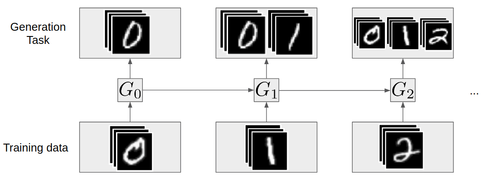
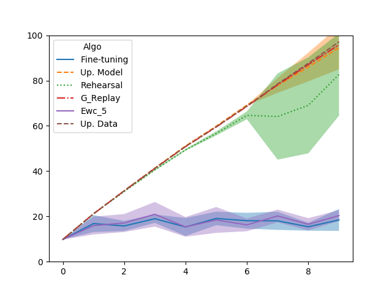
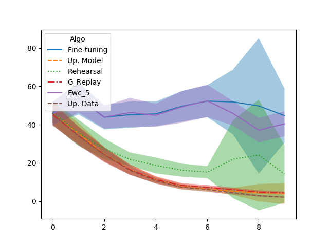
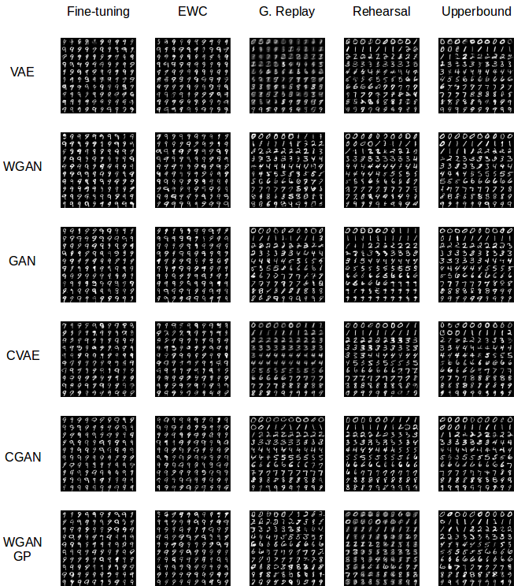

# Generative Models from the perspective of Continual Learning
*Timothée Lesort, Hugo Caselles-Dupré, Michael Garcia-Ortiz, Andrei Stoian, David Filliat*; **IJCNN 2019, Budapest**

## Abstract

Which generative model is the most suitable for Continual Learning? This paper aims at evaluating and comparing generative models on disjoint sequential image generation tasks.<br />
We investigate how several models learn and forget, considering various strategies: rehearsal, regularization, generative replay and fine-tuning. We used two quantitative metrics to estimate the generation quality and memory ability. We experiment with sequential tasks on three commonly used benchmarks for Continual Learning (MNIST, Fashion MNIST and CIFAR10).<br />
We found that among all models, the original GAN performs best and among Continual Learning strategies, generative replay outperforms all other methods. Even if we found satisfactory combinations on MNIST and Fashion MNIST, training generative models sequentially on CIFAR10 is particularly instable, and remains a challenge.<br />


Example of generative tasks sequence and generation capability to reach.


### Citing the Project

```Array.<string>
@inproceedings{lesort2019generative,
  title={Generative models from the perspective of continual learning},
  author={Lesort, Timoth{\'e}e and Caselles-Dupr{\'e}, Hugo and Garcia-Ortiz, Michael and Stoian, Andrei and Filliat, David},
  booktitle={2019 International Joint Conference on Neural Networks (IJCNN)},
  pages={1--8},
  year={2019},
  organization={IEEE}
}

```
## Installation

### Clone Repos

```bash
git clone https://github.com/TLESORT/Generation_Incremental.git
```

### Create Set-up

#### Manual

```bash
pytorch 0.4
torchvision 0.2.1
imageio 2.2.0
tqdm 4.19.5
```

#### Conda environmnet

```bash
conda env create -f environment.yml
source activate py36
```

#### Docker environmnet

TODO

## Experiments Done

#### Dataset

* MNIST
* Fashion MNIST


#### Generative Models

* GAN
* CGAN
* WGAN
* WGAN_GP
* VAE
* CVAE

#### Task

* Disjoint tasks -> 10 tasks


#### To Add

* Cifar10

## Run experiments


```bash

cd Scripts
./generate_test.sh
./test_todo.sh
```


NB : Test todo will contains all bash commands to run since it may takes some days to run them all you can choose one of them manually and run it in the main repository
Manual Example of commands for training and evaluating *Generative_replay* with *GAN* on Mnist :

Generate Data
```bash
cd ./Data
#For the expert
python main_data.py --task disjoint --dataset mnist --n_tasks 1 --dir ../Archives
#For the models to train
python main_data.py --task disjoint --dataset mnist --n_tasks 10 --dir ../Archives
#For Upperbound and FID
python main_data.py --task disjoint --upperbound True --dataset mnist --n_tasks 10 --dir ../Archives

# Go back to main repo
cd ..
```

Train Expert to compute later FID
```bash
python main.py --context Classification --task_type disjoint --method Baseline --dataset mnist --epochs 50 --epoch_Review 50 --num_task 1 --seed 0 --dir ./Archives
```

Train Generator
```bash
python main.py --context Generation --task_type disjoint --method Generative_Replay --dataset mnist --epochs 50 --num_task 10 --gan_type GAN --train_G True --seed 0 --dir ./Archives
```

Review Generator with Fitting Capacity
```bash
python main.py --context Generation --task_type disjoint --method Generative_Replay --dataset mnist --epochs 50 --num_task 10 --gan_type GAN --Fitting_capacity True --seed 0 --dir ./Archives
```

Review Generator with FID
```bash
python main.py --context Generation --task_type disjoint --method Generative_Replay --dataset mnist --epochs 50 --num_task 10 --gan_type GAN --FID True --seed 0 --dir ./Archives
```

## print figures

Go to the main repository

Plot Fitting Capacity
```bash
python print_figures.py --fitting_capacity True
```

Plot FID
```bash
python print_figures.py --FID True
```


<table width="500" cellpadding="5">
<tr>
  
  <td align="center" valign="center">
    
  <br />
  Fitting capacity at each task : GAN MNIST
  </td>
  <td align="center" valign="center">
    
  <br />
  Fashion-Mnist at each task results.
  </td>

</tr>

</table>

## Plot Samples



